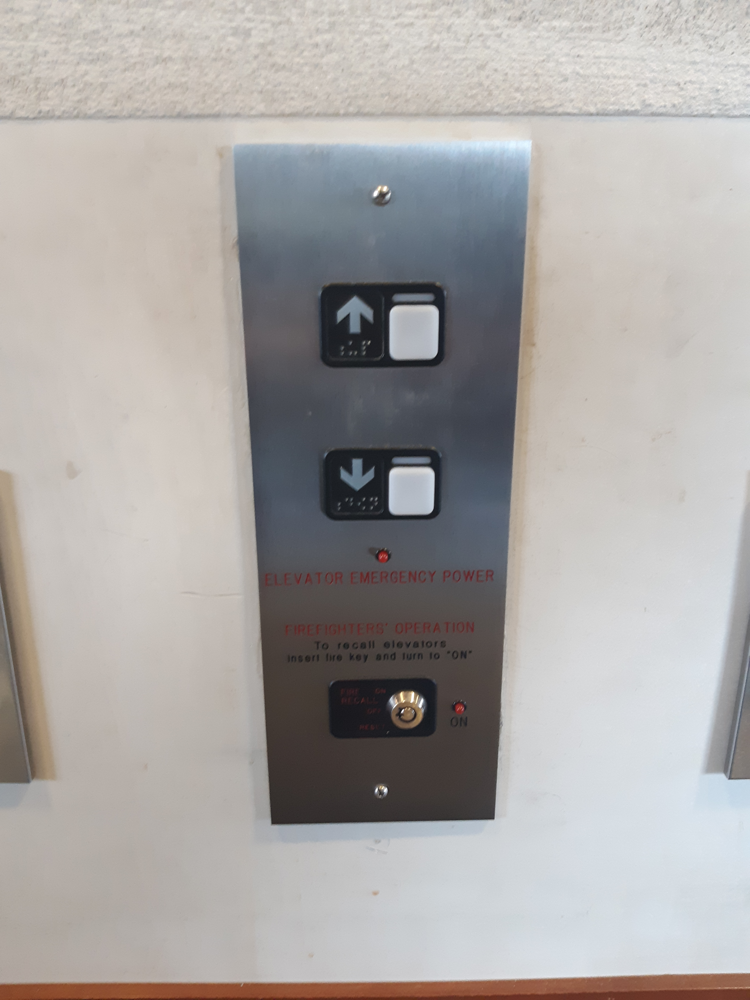
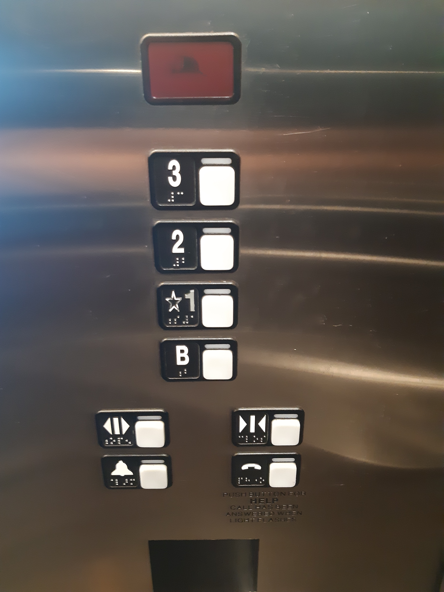

# homework1

#Issues

The issue with this interface was that even after pushing the button twice the elevator's door did not close.
The elevator did not even go to the floor I wanted it to go.

The common uses of Elevator

The most common use of Elevator is to take people from one floor to another.

The elevator interface should be simple and less complicated.

The elevators can provide a feedback by either blinking the button pushed or display the button pushed on the display. In addition to that it can play an voice recording of which button is pushed.

Mistakes that can be made in designing an elevator interface

1. Too many buttons close to each other.
2. Response time is more.

So the interface design I implemented provides 2 feedbacks to the user.
1. It displays the current operation to be performed.
2. It provides an audio message of which operation is performed when the button is pushed.

